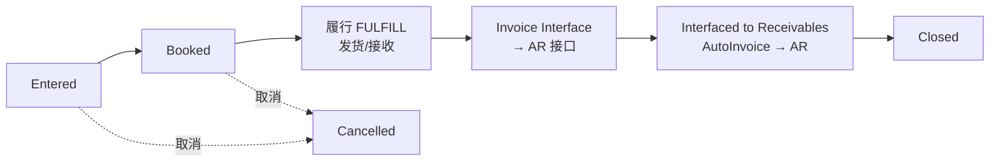

# 销售订单生命周期与状态机（T1）

> 本页为 **T1 官方文档原文**级知识，来源：Oracle Order Management User's Guide（e48843）。正文段落已从官方 HTML 章节提取，原始快照和链接见文末“证据索引”。尚未做实例验证，因此“系统行为”均为文档所述。

## 1. 订单头状态（全部）

来源：[e48843 · “Order Status List / Order Header Statuses”](../sources/e48843.md)

Active、Awaiting Invoice Interface - Incomplete Data、Awaiting Invoice Interface - On Hold、Awaiting Start Date、Booked、Cancelled、Closed、Customer Accepted、Draft、Draft - Customer Rejected、Draft - Internal Rejected、Draft Submitted、Entered、Expired、Internal Approved、Internal Rejected、Invoice Interface - Complete、Lost、Offer Expired、Pending Customer Acceptance、Pending Internal Approval、Submitted、Terminated、User Working

## 2. 订单行状态（全部）

来源：[e48843 · “Order Status List / Order Line Statuses”](../sources/e48843.md)

Awaiting Export Screening、Awaiting Fulfillment、Awaiting Invoice Interface - Incomplete Data、Awaiting Invoice Interface - On Hold、Awaiting Invoice Interface - Partially Interfaced, RFR Item、Awaiting Invoice Interface - Pending Complete Delivery、Awaiting Invoice Interface - RFR Item、Awaiting Invoice Interface - Unexpected error、Awaiting Payment Assurance - On Hold、Awaiting Payment Assurance - Receipts Not Assured、Awaiting Receipt、Awaiting Reprice - Invalid setup、Awaiting Reprice - On reprice line hold、Awaiting Reprice - Pricing error、Awaiting Reprice - Unexpected error、Awaiting Return、Awaiting Return Disposition、Awaiting Shipping、Awaiting Supply、Backordered、BOM and Routing Created、Booked、Cancelled、Closed、Completed Export Screening、Config Item Created、Customer Accepted、Data Error Export Screening、Draft、Draft - Customer Rejected、Draft - Internal Rejected、Draft Submitted、Entered、Fulfilled、Interfaced to Receivables、Internal Approved、Internal Rejected、Inventory Interfaced、Invoice Interface - Not Applicable、Lost、Offer Expired、PO-Created、PO-Partial、PO-Received、PO-ReqCreated、PO-ReqRequested、Partially Interfaced to Receivables、Payment Assurance - Complete、Payment Assurance - Incorrect Data、Pending Customer Acceptance、Pending Internal Approval、Picked、Picked Partial、Preprovision、Preprovision Failed、Preprovision Requested、Preprovision Succeeded、Production Complete、Production Eligible、Production Open、Production Partial、Provisioning Failed to update Transaction Details、Provisioning Rejected、Provisioning Requested、Provisioning Successful、Provisioning in Error、Released to Warehouse、Reprice - Complete、Reprice - Not Applicable、Returned、Scheduled、Shipped、Supply Eligible、Supply Open、Supply Partial、Third Party Billing Failed、Third Party Billing Requested、Third Party Billing Succeeded

> 文档注明：Kit 行若未一起发运，则按标准行处理、各自推进，不会因属于 Kit 而在 Fulfillment 等待。

## 3. 主生命周期（T1 归纳主线）

## 4. Booking（预订）

来源：[e48843 · “Booking / Manual Booking Process / Deferred Booking Process”](../sources/e48843.md)

- Booking 是**工作流驱动**的，官方种子流程有两种：
  - **手工预订** `BOOK_PROCESS_ASYNCH`：在 Sales Orders 窗口通过 “Book” 按钮（Progress Order）控制预订时点；用于在线创建的订单。
  - **延迟预订** `BOOK_PROCESS_DEFER`：订单头创建后由后台引擎（Background Engine）离线执行预订；用于批处理创建的订单。
- 行要等订单头预订事件，必须把行级子流程（`ENTER` 或 `BOOK_WAIT_FOR_H`）放在行流最前面。
- 官方说明：Book 活动不再做 Project/Task 校验（已移到 Enter）；Ship To 不再是退货/服务订单必填；付款条件不再是退货订单必填。

## 5. Fulfillment（履行）

来源：[e48843 · “Fulfillment in Oracle Order Management”](../sources/e48843.md)

- 履行 = 满足订单行完成条件；种子活动 `FULFILL` 是履行集合（fulfillment set）内多行的同步点。
- 标准可发运行：履行方法活动是 **shipping**；退货行：履行方法活动是 **receiving**。`FULFILL` 必须放在履行方法活动与 Invoice Interface 活动之间。
- 行流到达 `FULFILL` 时：
  - 履行方法活动成功后，用已发运/已接收数量更新 fulfilled quantity，置行“fulfilled”标志；
  - 不属于履行集合 → 完成 Fulfillment 继续下一活动；
  - 属于履行集合 → 检查集合内其余行：有未履行行则等待；全部履行后一起放行。
- 限制：一行属于两个履行集合时，两个集合全部履行后该行才能通过；集合内某行通知被拒绝，其余行不会推进，必须删除或取消该行。

## 6. Invoice Interface（开票接口）

来源：[e48843 · “Invoice Processing / Detailed Order Statuses for Invoicing”](../sources/e48843.md)

- 开票处理把订单/退货/运费数据经 Invoice Interface 活动写入 **AR 接口表**，之后必须运行 AR 的 **AutoInvoice** 并发程序才能进入 AR 生成发票/贷项。
- 支持订单头级（整单同时接口）与订单行级（行各自满足条件后接口）两种；部分数量接口仅行级开票支持。
- **不参与开票接口**的行（Invoice Interface 以 `Not Eligible` 完成）：
  - 物料属性 Invoiceable = No，或 Enabled Invoicing = No；
  - 配置项类型（Config item type）；
  - 服务项但服务对象不可服务；
  - 内部订单。
- **有 Hold 的订单/行不会接口**；遇到 On Hold 时活动以 `On Hold` 完成，可手工运行 Progress Order，或放行后系统按 12 小时间隔自动重估。
- 数量层级：Fulfilled quantity → Shipped quantity → Ordered quantity。
- 部分接口、RFR（Ready for Revenue）等细化状态见下面的 Flow Status 表。

### Flow Status — Invoice Processing（行状态细分）

来源：[e48843 · “Detailed Order Statuses for Invoicing”](../sources/e48843.md)

| Lookup Code | 行状态 |
| --- | --- |
| INVOICE_HOLD | Awaiting Invoice Interface – On Hold |
| INVOICE_INCOMPLETE | Awaiting Invoice Interface – Incomplete Data |
| INVOICE_DELIVERY | Awaiting Invoice Interface – Pending Complete Delivery |
| INVOICE_RFR | Awaiting Invoice Interface – RFR Item |
| PARTIAL_INVOICE_RFR | Awaiting Invoice Interface – Partially Interfaced, RFR Item |
| INVOICE_NOT_APPLICABLE | Invoice Interface – Not Applicable |
| INVOICED | Invoice Interface – Interfaced to Receivables |

### Flow Status — Repricing（重定价）

| Lookup Code | 行状态 |
| --- | --- |
| REPRICE_COMPLETE | Reprice – Complete |
| REPRICE_HOLD | Awaiting Reprice – On reprice line hold |
| REPRICE_NOT_ELIGIBLE | Reprice – Not Applicable |
| REPRICE_UNEXPECTED_ERROR | Awaiting Reprice – unexpected error |
| REPRICE_INVALID_SETUP | Awaiting Reprice – Invalid setup |
| REPRICE_PRICING_ERROR | Awaiting Reprice – Pricing error |

## 7. Cancellation（取消）

来源：[e48843 · “Sales Order Cancellation”](../sources/e48843.md)

- 官方预置取消点是 **Booked**：预订前把数量减到零视为“数量变更”而非取消；预订后视为取消并要求理由。
- 完全取消的结果：释放预留、行状态置为 Cancelled、开放数量归零、释放全部 Hold、关闭订单行。部分取消：释放预留、重定价、作废信用卡授权。
- 取消后的订单/行：状态 `Cancelled`，工作流状态 `Closed`。
- **系统级禁止取消**（system constraints，无法被用户约束放松）：
  - 订单或行已关闭；
  - 订单或行已取消；
  - 行已发运或已开票；
  - 退货行数量已接收或已贷记；
  - 直运行已在采购接收（receipt generated）。
- 已开票后绝大多数变更被阻止（[“Actions on Orders”](../sources/e48843.md)）。

## 8. Close（关闭）

来源：[e48843 · “Close Orders”](../sources/e48843.md)

- 关闭行/关闭订单由工作流实现（种子 close line / close order 子流程）。
- 行完成行级工作流全部活动后即满足关闭条件，行可独立关闭；行关闭后不可再修改订单信息。
- 订单头关闭流程会在**每月底**检查所有行是否已关闭，全部关闭后才关闭订单头；订单关闭后不能加行。
- Hold 影响：只有 generic holds 时仍可关闭；存在 activity-specific holds 时不关闭。

## 9. Holds（暂停）摘要

来源：[e48843 · “Overview of Holds”](../sources/e48843.md)

- Hold 阻止订单/行继续推进工作流；可手工或按规则自动应用（如信用检查）。
- 信用检查评估顺序：订单总额 vs 订单限额 →（若装 OCM）逾期发票 → 敞口 vs 信用限额；任一失败即挂 Hold，并把原因消息传给 OCM。
- Hold Source 可按客户/地点/物料/订单类型/仓库等条件批量挂起现有与未来订单/行；客户 Profile 的 Credit Hold 勾选会创建全局或站点级 Hold Source。

## 证据索引

| 知识点 | 官方章节 | 官方 URL | raw 快照 |
| --- | --- | --- | --- |
| 状态清单 | Order Status List | https://docs.oracle.com/cd/E26401_01/doc.122/e48843/T335476T347163.htm | [T335476T347163.htm](../../sources/docs/e48843/chapters/T335476T347163.htm) |
| Booking / Fulfillment | Order Capture（Booking、Fulfillment in OM） | https://docs.oracle.com/cd/E26401_01/doc.122/e48843/T335476T429676.htm | [T335476T429676.htm](../../sources/docs/e48843/chapters/T335476T429676.htm) |
| Invoice Interface / Flow Status | Invoicing and Payments | https://docs.oracle.com/cd/E26401_01/doc.122/e48843/T335476T429682.htm | [T335476T429682.htm](../../sources/docs/e48843/chapters/T335476T429682.htm) |
| Cancellation / Close / Holds | Actions on Orders | https://docs.oracle.com/cd/E26401_01/doc.122/e48843/T335476T429679.htm | [T335476T429679.htm](../../sources/docs/e48843/chapters/T335476T429679.htm) |

## Open Questions

- 状态**转换矩阵**（哪些活动/并发程序把 A 状态改成 B 状态）分散在各章，尚未逐条整理成完整矩阵。
- “预订前后哪些字段被锁定”的完整列表（在实施手册 e48842 中，待摄入）。
- 企业实例的交易类型→工作流映射（无权限，留白）。
