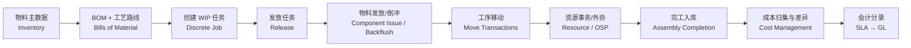

# 离散制造闭环

## 流程总览

## 各步骤的证据与文档定位

| 步骤 | 说明 | 主要证据 |
| --- | --- | --- |
| 物料主数据 | 物料、组织、子库、批次/序列、状态 | [e48820 · Item Setup and Control](../sources/e48820.md) |
| BOM/工艺路线 | 组件清单、工序、资源需求 | [e48954 BOM](../sources/e48954.md)、[e48905 · Routings and Operations](../sources/e48905.md) |
| 创建任务 | 手工/自动/导入 | [e48905 · Overview of Creating Discrete Jobs](../sources/e48905.md) |
| 发放 | 任务状态进入 Released | [e48905 · Releasing Discrete Jobs](../sources/e48905.md) |
| 物料发放 | Push/Pull/倒冲、发料/退料 | [e48905 · Material Control](../sources/e48905.md) |
| 工序移动 | 移动事务、完工/返回规则 | [e48905 · Move Transactions](../sources/e48905.md) |
| 资源事务 | 人工/机器工时、外协 PO | [e48905 · Resource Management](../sources/e48905.md)、[Outside Processing](../sources/e48905.md) |
| 完工入库 | 完工事务进入 Inventory | [e48905 · Assembly Completions and Returns](../sources/e48905.md) |
| 成本归集 | WIP 成本、完工差异、期间关闭 | [e48829 Cost Management](../sources/e48829.md)、[e48905 · WIP Costing](../sources/e48905.md) |
| 会计分录 | 事件驱动生成分录并转 GL | [e48771 SLA](../sources/e48771.md)、[e48747 GL](../sources/e48747.md) |

## 状态与边界

- 任务生命周期：Unreleased → Released → Complete → Closed（T2 归纳，状态规则以 [e48905 · Job and Repetitive Schedule Statuses](../sources/e48905.md) 正文为准）。
- 未验证：各事务对 WIP 估价、库存价值与总账的影响顺序（依赖实例验证）。

## 相关页面

- [WIP 域](../domains/work-in-process.md)
- [Inventory 域](../domains/inventory.md)
- [Order Management 域](../domains/order-management.md)
- [Intercompany 域](../domains/intercompany.md)
